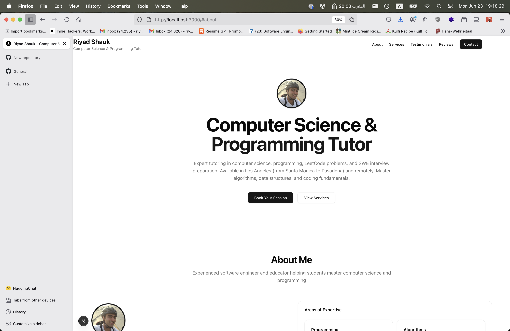

# Riyad Shauk - Computer Science Tutoring

A modern, SEO-optimized Next.js website for computer science tutoring services, featuring a review system with PostgreSQL database and photo uploads.



## Features

- **SEO Optimized**: Single-page website with structured data and local SEO for Los Angeles
- **Review System**: Submit and display reviews with optional photo uploads
- **Modern UI**: Built with ShadCN UI components and Tailwind CSS
- **Database**: PostgreSQL with Drizzle ORM for data persistence
- **Responsive**: Works seamlessly on desktop and mobile devices
- **Photo Uploads**: Reviewers can optionally upload photos with their reviews
- **Local SEO**: Optimized for Los Angeles area
- **Environment Management**: Support for multiple environments with special character handling

## Tech Stack

- **Framework**: Next.js 15 with App Router
- **Language**: TypeScript
- **Styling**: Tailwind CSS + ShadCN UI
- **Database**: PostgreSQL with Drizzle ORM
- **Package Manager**: pnpm
- **File Uploads**: Local disk storage with Next.js API routes
- **Environment**: Zod validation with Next.js environment conventions

## Getting Started

### Prerequisites

- Node.js 18+ 
- pnpm (recommended) or npm
- PostgreSQL (will be installed automatically by the setup script)

### Installation

1. **Clone the repository**
   ```bash
   git clone <your-repo-url>
   cd riyadshauk.com-2025
   ```

2. **Install dependencies**
   ```bash
   pnpm install
   ```

3. **Setup environment variables**
   ```bash
   # Create environment file from template
   pnpm run env:create:local
   
   # Or manually copy and edit
   cp .env.example .env.local
   ```

4. **Setup database**
   ```bash
   # Make the setup script executable
   chmod +x scripts/setup-database.sh
   
   # Run the database setup (works on macOS and Linux/Raspberry Pi)
   ./scripts/setup-database.sh
   ```

5. **Run database migrations**
   ```bash
   pnpm run db:generate && pnpm run db:migrate
   ```

6. **Start the development server**
   ```bash
   pnpm run dev
   ```

Open [http://localhost:3000](http://localhost:3000) with your browser to see the result.

## Environment Configuration

The application uses Next.js environment conventions with automatic special character handling:

### Environment Files (Next.js Conventions)

- `.env` - Base environment variables (loaded first)
- `.env.local` - Local development overrides (loaded in development only)
- `.env.production` - Production environment (loaded in production only)

### Environment Variables

The application uses individual database components for better special character support:

```bash
# Database configuration (recommended for special characters)
DB_USER=riyadshauk_user
DB_PASSWORD=my@complex#password$2025
DB_NAME=riyadshauk_tutoring
DB_HOST=localhost
DB_PORT=5432

# Environment
NODE_ENV=development

# Email configuration (optional)
EMAIL_USER=your-email@gmail.com
EMAIL_PASS=your-app-password
```

### Special Character Support

The system automatically handles special characters in database credentials:

- **Passwords**: Supports `@`, `#`, `$`, `%`, `&`, `+`, `=`, etc.
- **Usernames**: Supports email addresses and special characters
- **Hosts**: Supports domain names with special characters
- **Automatic Encoding**: Special characters are URL-encoded when constructing the DATABASE_URL

### Environment Management Commands

```bash
# Validate environment files
pnpm run env:validate

# Show environment information
pnpm run env:info

# Create environment files from templates
pnpm run env:create:local
pnpm run env:create:production

# Test database connection
pnpm run env:test
```

### Manual Environment Setup

If you prefer to set up environment files manually:

1. **Development** (`.env.local`):
   ```bash
   # Copy template
   cp .env.example .env.local
   
   # Edit with your settings
   nano .env.local
   ```

2. **Production** (`.env.production`):
   ```bash
   # Copy production template
   cp .env.production.example .env.production
   
   # Edit with production settings
   nano .env.production
   ```

## Database Management

### Useful Commands

```bash
# Generate new migrations
pnpm run db:generate

# Run migrations
pnpm run db:migrate

# View database in browser
pnpm run db:studio

# Reset database (development only)
pnpm run db:reset
```

### Database Schema

The application uses a single `reviews` table with the following structure:

- `id`: Unique identifier
- `name`: Reviewer's name
- `email`: Reviewer's email
- `rating`: Rating (1-5 stars)
- `comment`: Review text
- `verified`: Whether the review has been verified (default: false)
- `photoUrl`: Optional path to uploaded photo
- `createdAt`: Timestamp of review creation
- `updatedAt`: Timestamp of last update

### Database Setup Script

The `scripts/setup-database.sh` script automatically:

- Detects your operating system (macOS or Linux)
- Installs PostgreSQL if needed
- Creates database user and database
- Sets up environment variables with special character support
- Runs initial migrations

## Project Structure

```
riyadshauk.com-2025/
├── src/
│   ├── app/                    # Next.js App Router
│   │   ├── api/               # API routes
│   │   │   ├── reviews/       # GET reviews endpoint
│   │   │   └── submit-review/ # POST review submission
│   │   ├── favicon.ico        # Favicon
│   │   ├── globals.css        # Global styles
│   │   ├── layout.tsx         # Root layout with metadata
│   │   └── page.tsx           # Home page
│   ├── components/            # React components
│   │   ├── ui/               # ShadCN UI components
│   │   │   ├── badge.tsx
│   │   │   ├── button.tsx
│   │   │   ├── card.tsx
│   │   │   ├── input.tsx
│   │   │   ├── label.tsx
│   │   │   ├── select.tsx
│   │   │   ├── separator.tsx
│   │   │   └── textarea.tsx
│   │   ├── ReviewForm.tsx     # Review submission form with photo upload
│   │   └── ReviewsDisplay.tsx # Reviews display component
│   ├── db/                   # Database configuration
│   │   ├── index.ts          # Database client setup
│   │   └── schema.ts         # Database schema definition
│   └── lib/                  # Utility functions
│       ├── env.ts            # Environment configuration with validation
│       └── utils.ts          # Helper functions
├── public/                   # Static assets
│   ├── uploads/             # User uploaded photos
│   ├── favicon.ico          # Favicon
│   ├── favicon.svg          # SVG favicon
│   └── profile-placeholder.png # Profile image placeholder
├── drizzle/                 # Database migrations
│   ├── 0000_right_the_phantom.sql
│   ├── 0001_messy_rick_jones.sql
│   └── meta/               # Migration metadata
├── scripts/                 # Setup and utility scripts
│   ├── setup-database.sh   # Cross-platform database setup
│   └── env-helper.sh       # Environment management utilities
├── components.json         # ShadCN UI configuration
├── drizzle.config.ts       # Drizzle ORM configuration
├── .env.example            # Environment variables template
├── .env.production.example # Production environment template
├── next.config.ts          # Next.js configuration
├── package.json            # Dependencies and scripts
├── tailwind.config.ts      # Tailwind CSS configuration
└── tsconfig.json           # TypeScript configuration
```

## API Endpoints

### GET /api/reviews
Returns all reviews from the database.

**Response:**
```json
[
  {
    "id": 1,
    "name": "John Doe",
    "email": "john@example.com",
    "rating": 5,
    "comment": "Great tutor!",
    "verified": true,
    "photoUrl": "/uploads/review-1.jpg",
    "createdAt": "2024-01-01T00:00:00.000Z"
  }
]
```

### POST /api/submit-review
Submits a new review with optional photo upload.

**Request:** `multipart/form-data`
- `name`: Reviewer's name (required)
- `email`: Reviewer's email (required)
- `rating`: Rating 1-5 (required)
- `comment`: Review text (required)
- `photo`: Image file (optional)

**Response:**
```json
{
  "success": true,
  "message": "Review submitted successfully"
}
```

## Deployment

### Local Raspberry Pi Deployment

1. **Setup Raspberry Pi**
   ```bash
   # On your Raspberry Pi
   ./scripts/setup-database.sh
   ```

2. **Configure environment**
   ```bash
   # Update .env.local with production settings
   cp .env.example .env.local
   # Edit with secure passwords and correct host settings
   ```

3. **Build and start**
   ```bash
   pnpm run build
   pnpm start
   ```

### Cloud Deployment

For cloud deployment (Vercel, Railway, etc.):

1. Set the environment variables in your deployment platform's dashboard
2. Ensure the `DATABASE_URL` points to your production database
3. For photo uploads, consider using cloud storage (S3, Cloudinary) instead of local disk

## Development

### Adding New Features

1. **Database Changes**: Update `src/db/schema.ts` and run migrations
2. **UI Components**: Add to `src/components/` or `src/components/ui/`
3. **API Routes**: Create new files in `src/app/api/`
4. **Styling**: Use Tailwind CSS classes and ShadCN components

### Code Style

- TypeScript for type safety
- ESLint for code quality
- Prettier for code formatting
- Conventional commit messages

## License

This project is licensed under the MIT License - see the [LICENSE](LICENSE) file for details.
